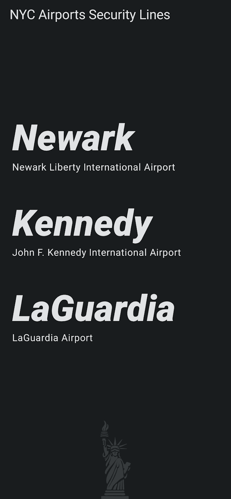
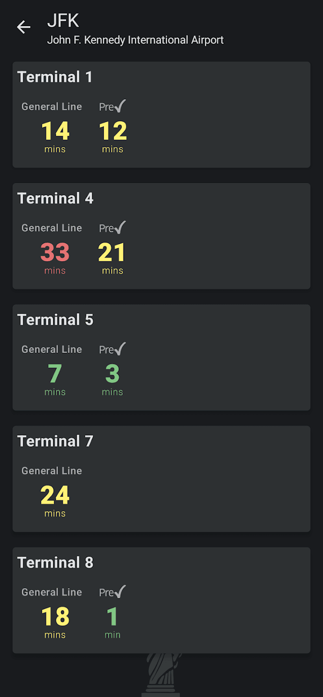
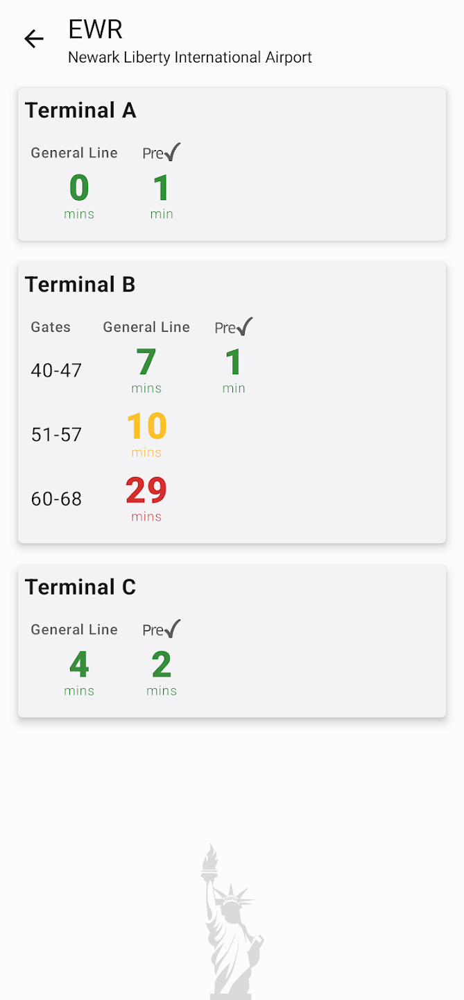
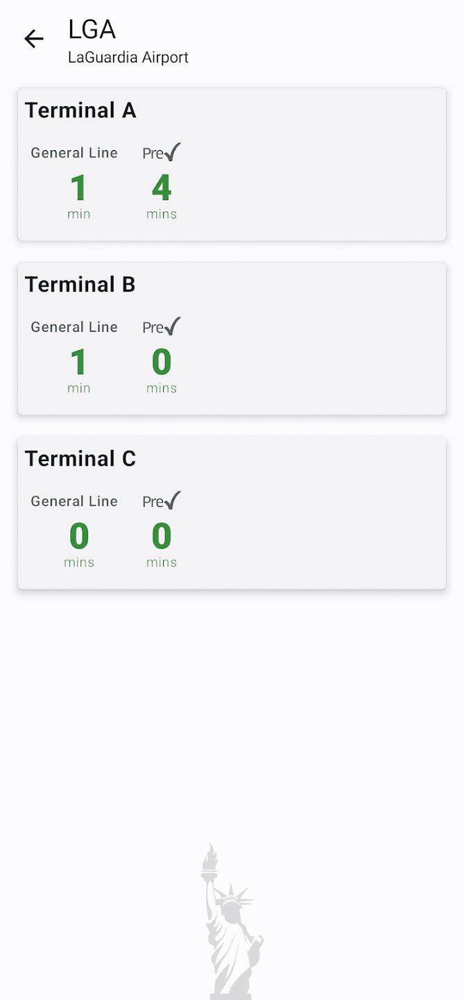

# NYC Airports Security Lines

An Android app to see how long the security lines are at JFK, LGA & EWR airports.

Some features of the app:
* See each airport's security wait times at a glance.
* See the general line vs the TSA PreCheck line.

## Development

Built with:
* 100% Kotlin
* UI in 100% [Jetpack Compose](https://developer.android.com/jetpack/compose)
* [Kotlin Flow](https://kotlinlang.org/docs/flow.html)
* [Android ViewModels](https://developer.android.com/topic/libraries/architecture/viewmodel)
* Screenshot generation with [Paparazzi](https://github.com/cashapp/paparazzi)
* Framing screenshots with [framer](https://github.com/amandeepg/framer)

## Screenshots
   
